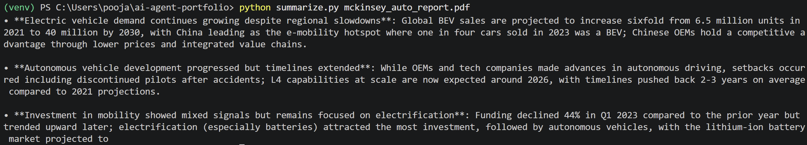

# PDF Summarizer with Claude

Summarize any PDF in exactly 5 lines using Claude API.

## Demo



## What it does

Takes a PDF file as input, extracts text via pypdf, sends to Claude, prints a 5-line summary.

Built as part of my AI PM learning journey — a baby version of RAG that taught me the basics of document loading, context windows, and prompt design.

## Quick start

```bash
pip install anthropic pypdf
python summarise.py yourfile.pdf
```

Set your `ANTHROPIC_API_KEY` in the script before running.

## How it works

1. Reads PDF using `pypdf`
2. Extracts all text content
3. Sends to Claude API with a 5-line summary instruction
4. Prints result

## Tech stack

- Python 3.11+
- Anthropic SDK
- pypdf

## What I learned

- Context window management for long documents
- The difference between summarization and Q&A (next project)
- Why prompt specificity matters ("exactly 5 lines" vs "summarize")

## Author

Adarsh Shrivastava — [LinkedIn]([https://linkedin.com/in/adarsh-p110293]) · [GitHub](https://github.com/AdarshShrivastava1102)
